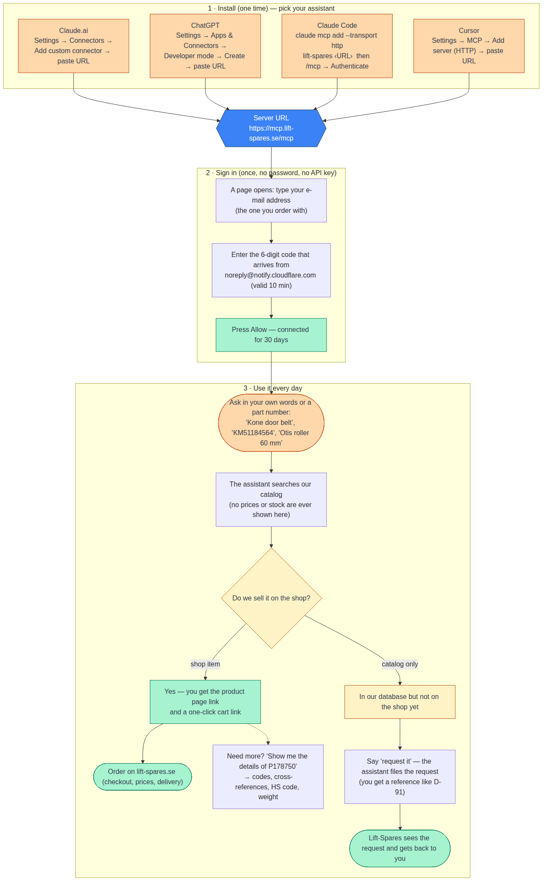

# Lift-Spares Parts Finder for your AI assistant

[Lift-Spares](https://lift-spares.se) (Elegant Lift Sweden AB) offers a connector for the AI assistant you
already use: Claude, ChatGPT, Claude Code, Cursor or any other assistant that supports MCP servers. Once added,
your assistant can identify lift (elevator) spare parts in the Lift-Spares catalog by part number, description,
make, model or part type, in any language, and hand you the product page and a cart link to order on the website.
Parts that are not on the website can be requested from the same chat.

**Server URL:** `https://mcp.lift-spares.se/mcp`

## Sign in

When you add the server, your assistant opens a sign-in page. Enter your **e-mail address**, press *Send login
code*, type the **6-digit code** that arrives from `noreply@notify.cloudflare.com` (subject "Cloudflare Access
login code for mcp.lift-spares.se", valid 10 minutes), then press **Allow**. No API key, no password. Use the
e-mail address you order with on lift-spares.se so your requests can be matched to your customer account. The
sign-in is remembered for 30 days.

## Add it to your assistant

| Assistant | How |
|---|---|
| Claude.ai / Claude desktop | Settings → Connectors → *Add custom connector* → URL `https://mcp.lift-spares.se/mcp` → the e-mail + code sign-in opens → *Allow*. |
| Claude Code | `claude mcp add --transport http lift-spares https://mcp.lift-spares.se/mcp`, then `/mcp` → *Authenticate*: the browser opens the e-mail + code sign-in, press *Allow*, and the tools appear. |
| ChatGPT (developer mode) | Settings → Connectors → *Create* → MCP server URL `https://mcp.lift-spares.se/mcp`, authentication OAuth → e-mail + code → *Allow*. |
| Cursor | Settings → MCP → *Add new global MCP server*: `{"mcpServers": {"lift-spares": {"url": "https://mcp.lift-spares.se/mcp"}}}`, then sign in from the MCP settings (e-mail + code → *Allow*). |

Any other MCP client that supports streamable HTTP with OAuth sign-in works the same way. We have verified the
flow with Claude Code; the other clients follow the same standard but have not yet been exercised by us. Tell us
if one misbehaves: https://lift-spares.se/pages/kontakt.

## What you can ask

Talk to your assistant as you would to a parts desk:

- *"Find KM587123G01"* — an exact part number comes first, with at most a few possible alternatives.
- *"Kone door roller 60 mm"*, *"Otis landing door lock"*, *"Schindler frequency inverter"* — words in any language.
- *"Show me everything about P142409"* — the full identification of one part: titles, identifiers, barcode,
  vendor, type, description, HS code, weight, country of origin.
- *"Request this for me, quantity 4"* — for a part that is in the Lift-Spares catalog but not on the website,
  or not in the catalog at all. The request reaches the Lift-Spares team and you get a reference number.
  No order is placed and no reply arrives in the chat.

Results tell you whether a part is **on the website** (product page + cart link) or **in the catalog only**
(requestable). Prices and stock levels are never shown in the chat, by design: they are on the product page.

## Ordering

The assistant never orders for you. It gives you the product page and a link that puts the part in your cart on
lift-spares.se; price, availability and checkout are on the website as always.

## Privacy

Searches and requests made through this service are recorded by Lift-Spares. No e-mail address, name or IP
address is stored with them. Questions: https://lift-spares.se/pages/kontakt.

## License

Copyright 2026 Elegant Lift Sweden AB. All rights reserved. This repository is an install guide only; the
server's source code is not published. See `LICENSE`.
